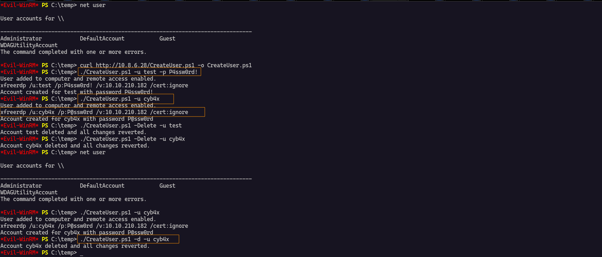
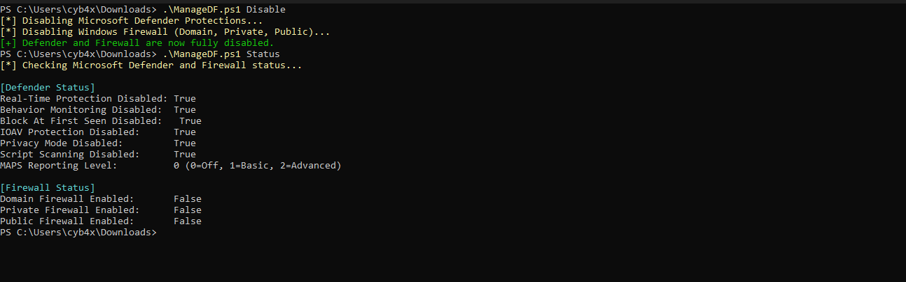

# PScheats

PScheats is a collection of PowerShell scripts designed to automate common tasks during Active Directory penetration testing and other administrative tasks. These scripts aim to save time during engagements by automating mundane tasks such as creating users, managing remote access, and Disabling AV and Defenders.

---

## 1. CreateUser.ps1

The `CreateUser.ps1` script allows you to automate the creation of a user on a Windows machine. It will:
1. Create a user with a default or custom password.
2. Add the user to the local `Administrators` and `Remote Desktop Users` groups.
3. Enable Remote Desktop (RDP) on the machine.
4. Attempt to add the user to the "`Domain Admins`" group (if possible).
5. Provide a pre-configured `xfreerdp` command to connect to the machine via RDP.

### Parameters
- `username`: The username to create. (Required)
- `password`: The password for the created user. (Optional, default is `P@ssw0rd`)
- `-Delete`: If specified, the script will delete the user and revert all changes.

### Example Usage

#### To create a user with the default password `P@ssw0rd`:
```powershell
.\CreateUser.ps1 -u testuser
```
#### To create a user with the custom password `P@ssw0rd#`:
```powershell
.\CreateUser.ps1 -u testuser -p P@ssw0rd#
```
#### To delete a user and revert all changes:
```powershell
.\CreateUser.ps1 -d testuser 
```


## 2. ManageDF.ps1

The `ManageDF.ps1` script allows you to **easily enable or disable Microsoft Defender** real-time protection and the **Windows Firewall** (Domain, Private, and Public profiles) on a Windows machine.  
It is useful for quick security configuration during testing, pentesting, or troubleshooting.

---

### What it Does
- Disables or enables Microsoft Defender real-time monitoring.
- Disables or enables Windows Firewall (all profiles).
- Monitor(If turned on, it diables)
- Accepts multiple ways of specifying the action (`Enable`, `Disable`, `-e`, `-d`, `--enable`, `--disable`).

---

### Parameters
- `Enable` / `-e` / `--enable` : Enables Defender and Firewall.
- `Disable` / `-d` / `--disable` : Disables Defender and Firewall.

---

### Example Usage
```powershell
Set-MpPreference -DisableRealtimeMonitoring $true
Set-MpPreference -DisableBehaviorMonitoring $true
Set-MpPreference -DisableBlockAtFirstSeen $true
Set-MpPreference -DisableIOAVProtection $true
Set-MpPreference -DisablePrivacyMode $true
Set-MpPreference -DisableScriptScanning $true
Set-MpPreference -SubmitSamplesConsent 2  
Set-MpPreference -MAPSReporting 0      
Set-NetFirewallProfile -Profile Domain,Private,Public -Enabled False
```

#### To check Defender and Firewall Status:
```powershell
.\ManageDF.ps1 Status
```

#### To monitor Defender and Firewall:
```powershell
.\ManageDF.ps1 Monitor
```

#### To disable Defender and Firewall:
```powershell
.\ManageDF.ps1 Disable
```

#### To Enable Defender and Firewall:
```powershell
.\ManageDF.ps1 Enable
```


